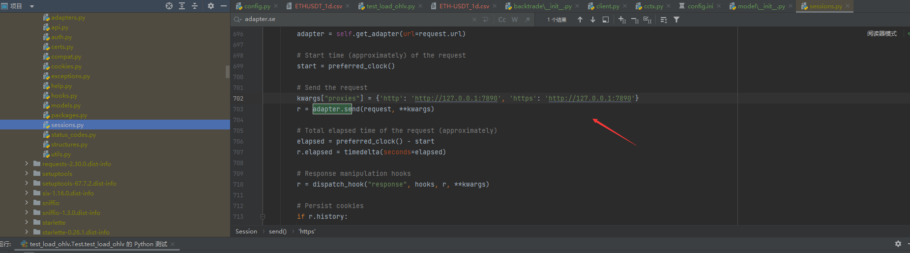

### 依赖生成

```
pip freeze > requirements.txt
```

### 代理配置



### 配置文件 （config.ini）

```
#交易参数
[trade]
# 交易品种
symbols = OPUSDT
# 交易时间级别
timeframe = 4h
# 测试数据开始日期
from_time = 2023-01-01
# 测试数据结束日期
to_time = 2023-05-08
# 是否允许做空
enable_shore = False
# 初始资金
balance = 1000
# 手续费
fee = 0.001

# 启动端口
[config]
host = 127.0.0.1
port = 8000
# 交易所配置
[ccxt]
api_key = None
secret = None
[strategy]
run_mod = Debug
```

