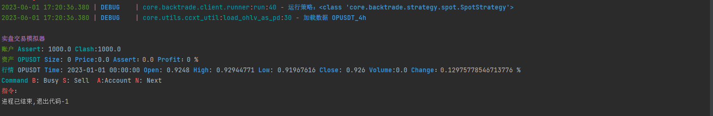

### 依赖生成

```
pip freeze > requirements.txt
```

### 安装依赖

```
pip install -r .\requirements.txt
```

### 代理配置


### 配置

```
配置文件读取
   优先读取 ./脚本目录路径/config.ini 
   默认读取 ./helper/config.ini  
   配置文件 config/config.py 
```

### 功能

- 数据下载
    - 虚拟货币k线数据
- 策略
    - 模拟现货交易
    - 模拟期货交易
- 回测
    - 控制台显示分析报告
    - 生成财务分析报告

### 现货模拟交易

- 默认配置文件运行

```python 
from core.backtrade.client.mock import SpotTradeClient
# 初始化时候client的config,默认从配置文件中加载
client = SpotTradeClient()
# 运行
client.run()


# 通过修改client.config属性,修改运行参数

```

- 自定义参数

```python
from core.backtrade.client.mock import SpotTradeClient

# 初始化时候client的config,默认从配置文件中加载
client = SpotTradeClient()
# config: TradeConfig
# 交易股票
client.config.trade_symbols = ['stock_name']
# 初始金额
client.config.trade_balance = 10000
...
...

# 运行
client.run()
```

- 运行结果
  

## 回测结果分析

### 控制台输出财务分析

- 配置文件中添加分析器 ConsoleAnalyzer

### 生成财务报告

- 配置文件中添加分析器 PyfolioReportAnalyzer

