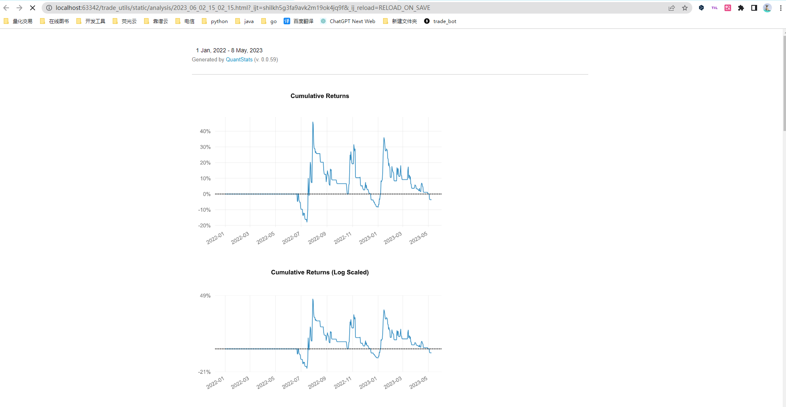

## 安装与配置

- 依赖生成

```
pip freeze > requirements.txt
```

- 下载

```
git clone https://github.com/lastestbots/trade.git
```

- 安装依赖

```
pip install -r .\requirements.txt
```

- VPN 配置

``` 
keyword['proxies'] = {'http':'htt://127.0.0.1:7890','https':'htt://127.0.0.1:7890'}
```


- 配置文件

```
配置文件读取
   优先读取 ./脚本目录路径/config.ini 
   默认读取 ./helper/config.ini  
设置多时间周期,按照时间级别从小到大设置
```

- 运行

```python
from core.backtrade.client.runner import StrategyRunner
from core.backtrade.strategy.rbreaker import RBreakerStrategy

# 创建策略运行器
runner = StrategyRunner()
# 指定策略
runner.config.strategy = RBreakerStrategy
# 运行
runner.run()
```

### 功能

- 数据下载
    - 虚拟货币k线数据
- 策略
    - 模拟现货交易
    - 模拟期货交易
    - BREAKER策略
    - 基于一目均衡策略
    - RIS策略
    - 价格通道策略
- 分析器
    - 控制台显示分析报告
    - 生成财务分析报告

### 现货模拟交易

- 加载历史数据, 在控制台输入指令,卖出股票操作
- 结果


### 一目均衡策略

- 参数
  
- 结果
  

### RSI策略

- 思路

```
symbols: ['ETHUSDT', 'BTCUSDT', 'SOLUSDT', 'LTCUSDT']
timeframe: 30m
sign: 
  rsi > 80 做空
  rsi < 20 做多

```

### 价格通道策略

- 思路

```
突破做多
```

- 结果
  

## 分析器

### 控制台分析

- 配置文件中添加分析器 ConsoleAnalyzer
  

### 财务报告分析

- 配置文件中添加分析器 PyfolioReportAnalyzer

